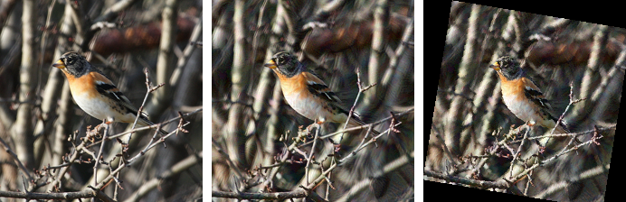
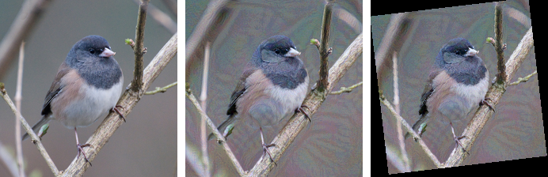

<h1 align="center">ROE-AA</h1>

## About

ROE-AA is the PyTorch-based code implementation of the paper "Robust Adversarial Attacks Against Unknown Disturbance via Reverse Evolutionary Optimization."

More detailed usage guide and data for our code will be provided soon. 

<p align="center">
  
</p>
<p align="center">
  
  <br>
  <span style="font-size: 0.9em; color: gray;">Adversarial examples and perturbations to adversarial examples by ROE-AA.</span>
</p> 


### Why ROE-AA


+ **Limitations of Existing Adversarial Attacks**: Current adversarial attacks have achieved successful applications across various fields. However, their effectiveness significantly declines when adversarial samples are subjected to even minor disturbances.
+ **Motivation for ROE-AA**: To address the issue of existing methods' reduced effectiveness under unknown disturbances. Based on reverse evolutionary optimization, a novel robust adversarial attack called REO-AA is proposed.
+ **Theoretical Support**: Theoretical analysis shows that REO-AA can increase the likelihood of adversarial samples falling under the target category distribution. This implies that the robustness of adversarial samples is competitive with that of the original data.
+ **Experimental Validation**: Extensive experiments on various tasks demonstrate that REO-AA exhibits superior robustness against various unknown disturbances compared to existing methods. Experimental results also show that REO-AA achieves the best transferability to target models in black-box settings.

## Requirements
+ Python >= 3.6
+ PyTorch >= 1.12.1
+ Torchvision >= 0.13.1
+ Timm >= 1.0.13
+ Insightface >= 0.7.3
+ Onnx >= 1.17.0


## Usage
We randomly sample 1,000 images from ImageNet-1K validate set, in which each image is from one category and can be correctly classified by the adopted models (For some categories, we cannot choose one image that is correctly classified by all the models. In this case, we select the image that receives accurate classifications from the majority of models.). Download the data from [
](https://drive.google.com/file/d/1d-_PKYi3MBDPtJV4rfMCCtmsE0oWX7ZB/view?usp=sharing) or [](https://huggingface.co/datasets/Trustworthy-AI-Group/TransferAttack/blob/main/data.zip) into `/path/to/data`. Then you can execute the attack as follows:

```
python main.py 
python face_raa.py
```

## Attacks and Models

### Attacks
The comparative adversarial attack methods involved in our experiments are as follows:

<table style="width: 60%; margin: auto; border-collapse: collapse;">

<thead>
<tr class="header">
<th><strong>Type </strong></th>
<th><strong>Attack</strong></th>
</tr>
</thead>

<tr>
<th rowspan="25"><sub><strong>Gradient</strong></sub></th>
<td><a href="https://arxiv.org/abs/1412.6572" target="_blank" rel="noopener noreferrer">FGSM (Goodfellow et al., 2015)</a></td>
</tr>

<tr>
<td><a href="https://arxiv.org/abs/1710.06081" target="_blank" rel="noopener noreferrer">MI-FGSM (Dong et al., 2018)</a></td>
</tr>

<tr>
<td><a href="https://arxiv.org/abs/2103.15571" target="_blank" rel="noopener noreferrer">VMI-FGSM (Wang et al., 2021)</a></td>
</tr>

<tr>
<td><a href="https://arxiv.org/abs/2103.15571" target="_blank" rel="noopener noreferrer">VNI-FGSM (Wang et al., 2021)</a></td>
</tr>

<tr>
<td><a href="https://arxiv.org/abs/2303.15109" target="_blank" rel="noopener noreferrer">DTA (Yang et al., 2023)</a></td>
</tr>

<tr>
<td><a href="https://openaccess.thecvf.com/content/ICCV2023/papers/Zhu_Boosting_Adversarial_Transferability_via_Gradient_Relevance_Attack_ICCV_2023_paper.pdf" target="_blank" rel="noopener noreferrer">GRA (Zhu et al., 2023)</a></td>
</tr>

<tr>
<td><a href="https://arxiv.org/abs/2306.05225" target="_blank" rel="noopener noreferrer">PGN (Ge et al., 2023)</a></td>
</tr>

<tr>
<td><a href="https://arxiv.org/abs/2307.02828" target="_blank" rel="noopener noreferrer">SMI-FGRM (Han et al., 2023)</a></td>
</tr>
<thead>
<tr>
<th rowspan="25"><sub><strong>Input transformation-based</strong></sub></th>
<td><a href="https://arxiv.org/abs/1803.06978" target="_blank" rel="noopener noreferrer">DIM (Xie et al., 2019)</a></td>
</tr>

<tr>
<td><a href="https://arxiv.org/abs/1904.02884" target="_blank" rel="noopener noreferrer">TIM (Dong et al., 2019)</a></td>
</tr>

<tr>
<td><a href="https://arxiv.org/abs/2308.10299" target="_blank" rel="noopener noreferrer">BSR (Wang et al., 2023)</a></td>
</tr>

<tr>
<td><a href="https://doi.org/10.1007/978-3-030-01264-9_28" target="_blank" rel="noopener noreferrer">TAP (Zhou et al., 2018)</a></td>
</tr>

<tr>
<td><a href="https://arxiv.org/abs/2304.13410" target="_blank" rel="noopener noreferrer">ILPD (Li et al., 2023)</a></td>
</tr>
</thead>
<table>

### Models

To thoroughly evaluate existing attacks, we have included various popular models, including CNNs ([ResNet-34](https://arxiv.org/abs/1512.03385), [ResNet-101](https://arxiv.org/abs/1512.03385), [DenseNet-121](https://arxiv.org/abs/1608.06993), [VGG-19](https://arxiv.org/abs/1409.1556), [Inception-v3](https://arxiv.org/abs/1512.00567)).
All models we used are based on PyTorch pretrained versions without any modifications.These models can be downloaded from Google Drive or Huggingface.

## Evaluation


## Acknowledgement
We thank all the researchers who contribute or check the methods. 


